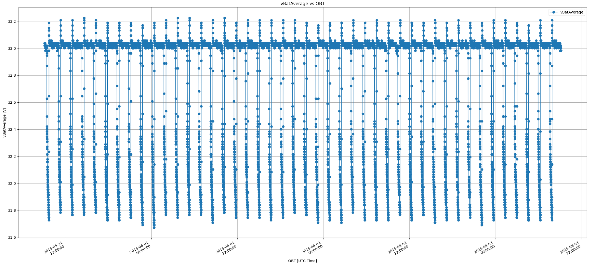
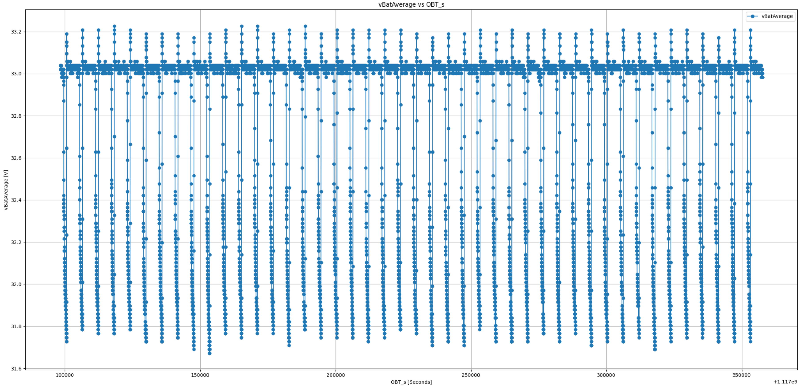
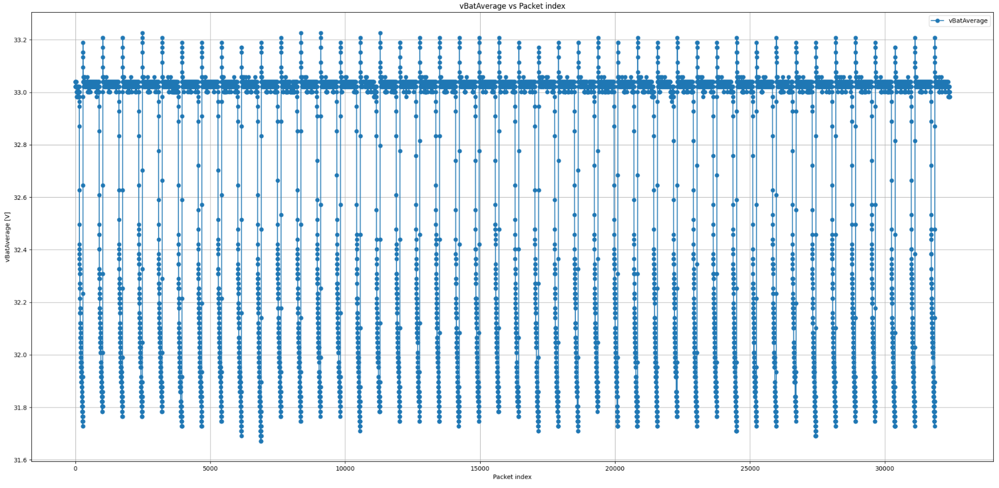

# SAC-D / Aquarius Telemetry Packet Parser

This repository provides a Python-based parser and visualization tool for SAC-D / Aquarius satellite telemetry binary files. It allows decoding, verifying, and plotting engineering telemetry directly from raw binary packets.

This code was developed as an exercise for the course "Programming Languages and Operating Systems for Space Applications" (Master’s in Space Application Software Development – UNLAM).

---

## Features

- Parse binary telemetry files into structured packets.
- Split packets into defined subsystem sections.
- Validate data integrity using CRC-16/BUYPASS.
- Extract specific telemetry fields (e.g., battery voltage, on-board time).
- Order packets by OBT (On-Board Time).
- Generate plots of telemetry parameters against:
  - Packet index
  - GPS Time (converted to UTC)
  - Seconds since epoch

---

## Repository Structure

```
.
├── images/ # Processed images used in README.md
├── src/
│ ├── init.py # Marks src as a Python package
│ ├── parser.py # Generic packet parser class (CRC, plotting, telemetry utilities)
│ ├── sacd.py # SAC-D/Aquarius mission-specific subclass
│ └── main.py # Command-line interface
├── .gitignore # Git ignore rules for generated files
├── README.md # Project documentation
└── requirements.txt # Project dependencies

````

---

## Installation

### 1. Create a Virtual Environment

From the root directory of the repository, create and activate a virtual environment:

**Linux / macOS:**
```bash
python3 -m venv venv
source venv/bin/activate
````

**Windows:**

```bash
python -m venv venv
venv\Scripts\activate
```

### 2. Install Dependencies

Install all dependencies listed in `requirements.txt`:

```bash
pip install -r requirements.txt
```

---

## Usage

Run the parser from the command line:

```bash
python src/main.py path/to/telemetry_file.bin [--check-crc] [--verbose]
```

### Arguments

| Argument           | Description                           | Default  |
| ------------------ | ------------------------------------- | -------- |
| `file_path`        | Path to the binary telemetry file     | Required |
| `--check-crc`      | Enable CRC validation for each packet | Disabled |
| `--verbose` / `-v` | Show progress during CRC validation   | Disabled |

---

## Example

An example telemetry file named
`CGSS_20150603_091700_10020150603085920_SACD_HKTMST.bin`
was used to develop and validate this parser.
Due to its size (>100 MB), it is not included in this repository.

Example command:

```bash
python src/main.py CGSS_20150603_091700_10020150603085920_SACD_HKTMST.bin --check-crc --verbose
```

When running with verbose mode and CRC checking:

```
Checking CRC of packet 32398/32398 (100.0%)
CRC check complete. All packets verified successfully.
```

---

## Example Plots

When executed, the program generates three plots:

1. **Battery Voltage vs UTC Time (from GPS OBT)**
   

2. **Battery Voltage vs OBT Seconds**
   

3. **Battery Voltage vs Packet Index**
   

---

## How It Works

* **`PacketParser`**: Base class that handles:

  * Packet splitting and section mapping
  * CRC checking
  * Telemetry field extraction
  * Plotting utilities

* **`SACDPacket`**: Subclass that defines:

  * Section layout (`frame_parts`)
  * Telemetry fields (`_fields`)
  * CRC-16/BUYPASS implementation
  * OBT-based packet ordering

### GPS Time Conversion

Telemetry timestamps are expressed as **seconds since 1980-01-06 00:00:00 UTC** (the GPS epoch).
These are automatically converted to **UTC datetimes** when plotting.

---

## Example Code

```python
from sacd import SACDPacket

with open("CGSS_20150603_091700_10020150603085920_SACD_HKTMST.bin", "rb") as f:
    data = f.read()

parser = SACDPacket(data)
packets = parser.get_packets(packets_with_sections=True, check_crc=True)
packets = parser.order_packets(packets)

# Plot battery voltage vs GPS time
parser.plot_telemetry_values("vBatAverage", packets, x_field="OBT")
```

## Author

Federico Nicolás Bua
